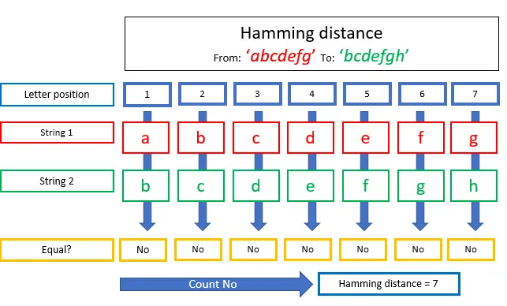

# Hamming Distance

The Hamming Distance compares every letter of the two strings based on position. So the first letter of word 1 is compared to the first letter of word 2 etc etc.

The Hamming Distance compares every letter of the two strings based purely on position.

